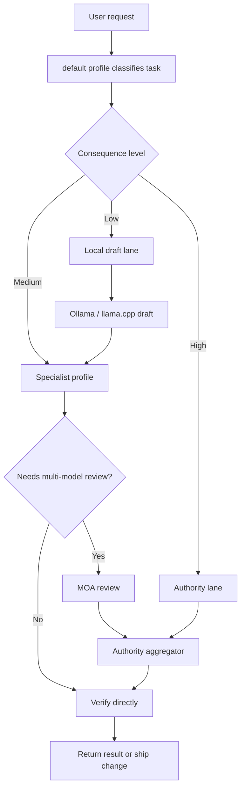

# Hermes Hybrid Agent Architecture

This architecture routes work by consequence. Local models handle cheap draft and reference work. The authority model handles final decisions, tool use, code, configuration, and money-facing output.

## Core Principle

Do not ask "which model is newest?" first.

Ask:

1. What is the cost of a wrong answer?
2. Does the task need fresh evidence, tools, code edits, or credentials?
3. Is local output good enough as a draft or second opinion?
4. Does disagreement between models add value?
5. Which profile should own verification?

## Workflow



Editable diagram source: [hermes-hybrid-agent-architecture.excalidraw](hermes-hybrid-agent-architecture.excalidraw)

## Model Lanes

| Lane | Responsibility | Example |
|---|---|---|
| Authority | Final answer, config, code, tool routing, production judgment | `openai-codex:gpt-5.5` |
| Local draft | Summaries, rough drafts, fast/private thinking | `llamacpp:Ornith-1.0-35B` |
| Local reference | Wider second opinion and strategy contrast | `ollama:gpt-oss:120b` |
| Experimental | Candidate model under canary review | `ollama:qwen3.6:35b-mlx` |
| MOA aggregator | Synthesizes references into one final judgment | Authority model |

The key safety rule is that the authority lane should fail loudly when unavailable. It should not silently downgrade to a weaker local model for production-sensitive work.

## Profile Roles

| Profile | Owns | Verification posture |
|---|---|---|
| `default` | User-facing routing, Telegram/Desktop, synthesis | Confirms profile, lane, and final output |
| `researcher` | Evidence, docs, APIs, market landscape | Checks sources and freshness |
| `coder` | Implementation, debugging, tests | Runs tests, reviews diffs, uses checkpoints/worktrees |
| `media` | Transcripts, media metadata, visual/audio workflows | Confirms media tools and source artifacts |
| `ops` | Hermes config, gateways, cron, plugins, rollback | Backs up, validates config, tests recovery path |

## Routing Matrix

| Task | First stop | Escalate when |
|---|---|---|
| Summarize notes | Local draft | Output becomes client-facing |
| Draft a plan | Local draft or `default` | The plan affects money, infra, or production |
| Research a claim | `researcher` | Freshness, citations, or official docs matter |
| Modify code | `coder` | Always authority-reviewed before shipping |
| Change Hermes config | `ops` | Always backup, check, and canary |
| Package media | `media` | Use authority review for public claims |
| High-value decision | MOA | Models disagree or decision has real consequence |

## MOA Policy

MOA is a review mode, not the default path.

Use MOA for:

- Architecture decisions.
- Business and pricing decisions.
- Production config changes.
- Code review before shipping important work.
- Situations where local disagreement can reveal missing assumptions.

Avoid MOA for:

- Small questions.
- Routine summaries.
- Cheap drafts.
- Work where one profile can verify directly.

## Verification

Minimum verification before promoting a lane or workflow:

```sh
hermes config check
for p in researcher coder media ops; do hermes --profile "$p" config check; done
hermes profile list
hermes moa list
curl -fsS http://127.0.0.1:8080/v1/models
curl -fsS http://127.0.0.1:11434/v1/models
hermes -z "Do not use tools. Reply exactly HERMES_DEFAULT_OK"
```

For code work:

- Inspect the diff.
- Run the relevant tests.
- Confirm no unrelated files were reverted.
- Use worktrees for substantial experiments.

For config work:

- Take a pre-change backup.
- Apply scoped edits.
- Run `hermes config check`.
- Restart only the affected services.
- Run exact-answer canaries.
- Keep rollback commands next to the rollout notes.

## Production Scope

This repo documents a working pattern, not a universal benchmark. A serious fork should define its own:

- Authority model.
- Local model set.
- Budget target.
- Hardware limits.
- Gateway strategy.
- Profile list.
- MOA presets.
- Rollback path.
- Promotion benchmarks.

