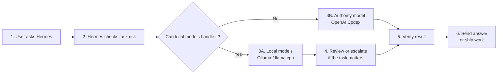

# Simple Workflow

This is the junior-friendly version of the Hermes Hybrid Agent Router.

The setup has one main idea:

> Do cheap thinking locally. Use the strongest model when the answer matters.

## Beginner Chart

## What Each Step Means

| Step | Meaning |
|---|---|
| 1. User asks Hermes | A request comes from Desktop, Telegram, CLI, API, or another Hermes entry point. |
| 2. Hermes checks task risk | Hermes decides whether a wrong answer would be costly, risky, or hard to undo. |
| 3A. Local models | Ollama or llama.cpp can draft, summarize, brainstorm, classify, and provide second opinions. |
| 3B. Authority model | OpenAI Codex handles code, config, tool use, money-facing output, and final decisions. |
| 4. Review or escalate | If local output becomes important, Codex reviews it before final use. |
| 5. Verify result | Tests, canaries, config checks, source checks, or rollback checks confirm the result. |
| 6. Send or ship | Hermes returns the answer, prepares a commit, updates a workflow, or sends a notification. |

## Easy Rule Of Thumb

Use local models when the task is:

- A rough draft.
- A summary.
- Brainstorming.
- A first-pass classification.
- A private note.
- A second opinion.

Use the authority model when the task involves:

- Code changes.
- Production config.
- Tool calls.
- Business or money-facing output.
- Client-facing writing.
- Anything that would be expensive to fix.

## Why This Saves Cost

Many tasks do not need the strongest model. Hermes can let local models do the early work, then spend hosted-model intelligence only when the result needs to be correct, verified, and trusted.

That is the point of the 20 percent target: reserve premium model usage for the highest-consequence work, while local models handle the routine thinking.

